# KIMI-K3-API-FREE

Исследовательская лаборатория на базе MetaTrader 5: аппроксимация неказуальной гауссовой производной цены LightGBM, вход по нескольким таймфреймам, Калман-фильтр, вейвлеты, «неказуальный учитель» и дашборды Streamlit. Плюс настройка бесплатного доступа к LLM Kimi K3 через OpenAI-совместимый API (файлы с ключом в репозиторий не выложены). Проект разрабатывался с участием Aider/DeepSeek.

## 🎯 Суть системы на словах

1. **Учитель — неказуальная гауссова производная.** Цель для обучения — не цена, а производная сглаженного ряда Close: `ПП = gaussian_filter1d(close, sigma, order=1, mode='reflect')`. Симметричная гауссова свёртка и стыки `mode='reflect'` не дают модели «смотреть в будущее». Серия `аппроксатор-перврй-производной*.py` (v1 → v9) эволюционирует: базовый аппроксиматор → ансамбли → мультитаймфрейм → «воронка» признаков → грид → **Калман** (`-9-КАЛМАН.py`) → проверка на Гауссе (`-9-проверка-гауса.py`). `Неказуальный-учитель.py` / `Неказуальный-учитель2*.py` — отдельная линия учителя с оценкой на краю истории и дашбордами (эквити, статистические фичи, ансамбль, мульти-варианты, «без выходных»).

2. **Аппроксиматор V1/V2 (Streamlit).** `lgbm_pp_approximator_V1*.py` и `lgbm_pp_approximator_V2*.py` — интерактивные исследовательские инструменты (НЕ торговые боты): забирает H1-бары из MT5, обучает LightGBM повторять сигнал учителя, строит графики «цель vs предсказание», эквити по знаку прогноза, gated vs base и т.д. Запуск: `streamlit run lgbm_pp_approximator_V2.py`.

3. **Вход по нескольким таймфреймам.** `вход-по-нескольким-таймфреймам*.py` — от базового скрипта к фильтрам по сессиям (`-3-только-сессии*`, `-ПРОДАКШН`) и боевым ботам (`-БОТ*.py`, версии для EURJPY, GBPJPY, USDJPY, USDCHF и «DEEPSEEK»): согласование сигналов моделей на разных ТФ, стат-фичи, ансамбли.

4. **Калман, вейвлеты, сканы.** `РКалман.py` — симуляция торговли с Калман-фильтром; `Скан-Калмана.py` — скан символов; `Вейвлеты.py` — разложение level-à-trous (колебание масштаба 2^level); `выбор.py` — walk-forward выбор N (вместо одного окна); `Дкмбель.py` — эксперимент с MT5; `111.py` — ветка про сокеты Blender (побочный эксперимент).

5. **Результаты.** Корневые PNG — сводные графики исследований (target vs prediction, kalman vs lgbm, confluence, gated vs base, финальные тесты); `scan_charts*` — графики по символам (AMD, AUDCAD, AUDJPY, …) для четырёх подходов: базовый, causal, d2, Калман, вейвлеты (по 34–97 PNG в каждой папке).

6. **Доступ к Kimi K3.** `KIMIAPI.py` / `Start_Aider_with_KIMI-3.bat` — запуск Aider и тестового запроса к бесплатной модели `moonshotai/kimi-k3-free` через `https://api.tokenrouter.com/v1` (OpenAI-совместимый клиент). **Файлы с API-ключом не выложены в репозиторий** — добавьте свой ключ локально.

## 📈 Графики результатов

| Target vs Prediction | Final test | No hysteresis |
|---|---|---|
| 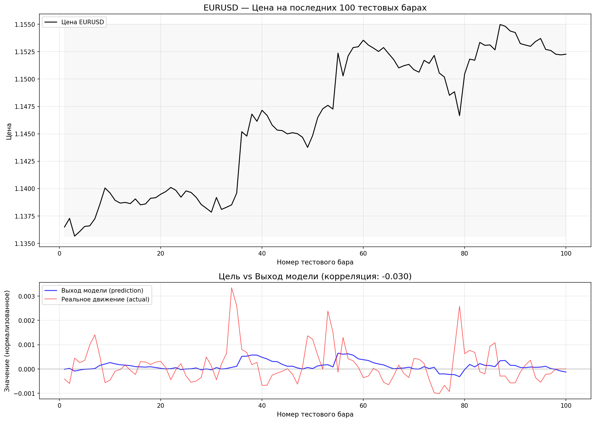 | 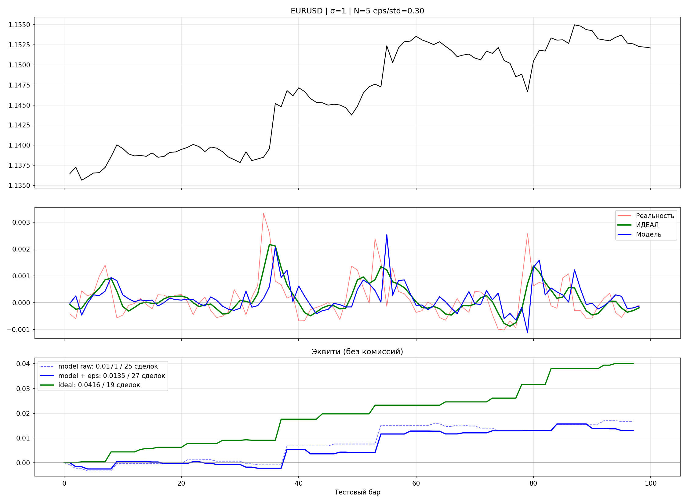 | 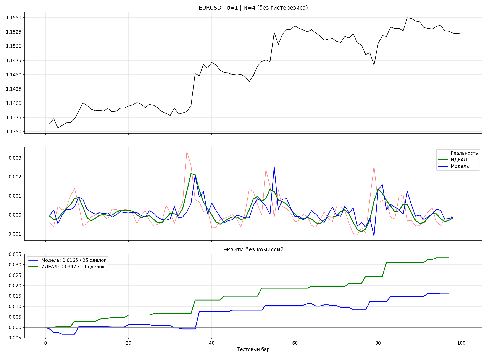 |

| Kalman vs LGBM | Gated vs Base | Confluence 20W |
|---|---|---|
| 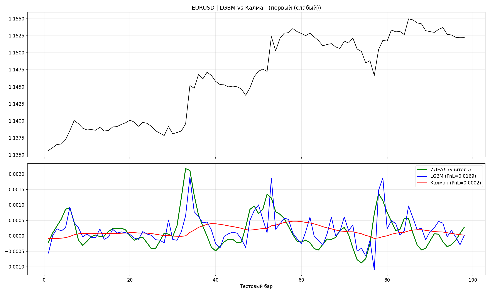 | 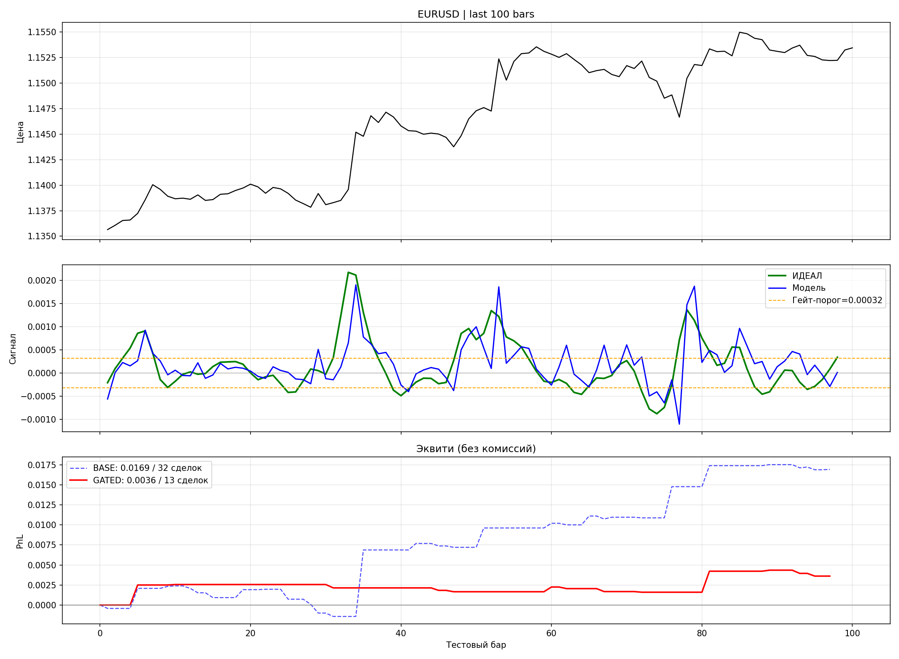 | 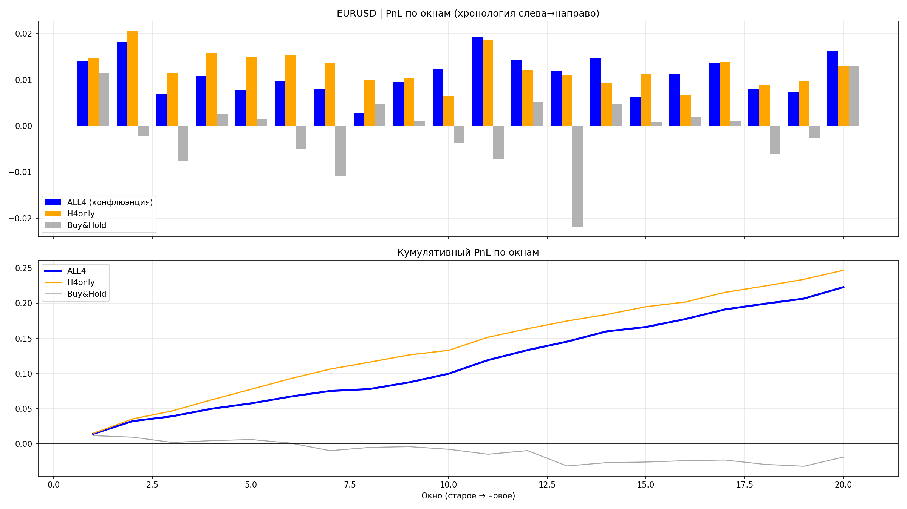 |

| Deep dive D1/D2 | Test 100 bars | H4 causal final |
|---|---|---|
| 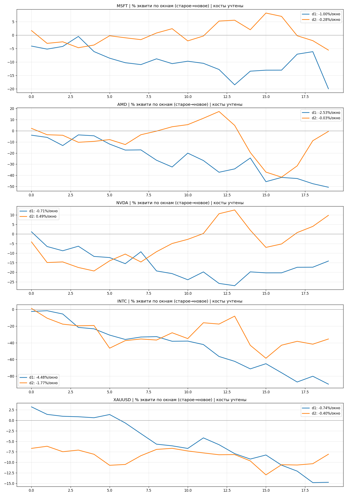 | 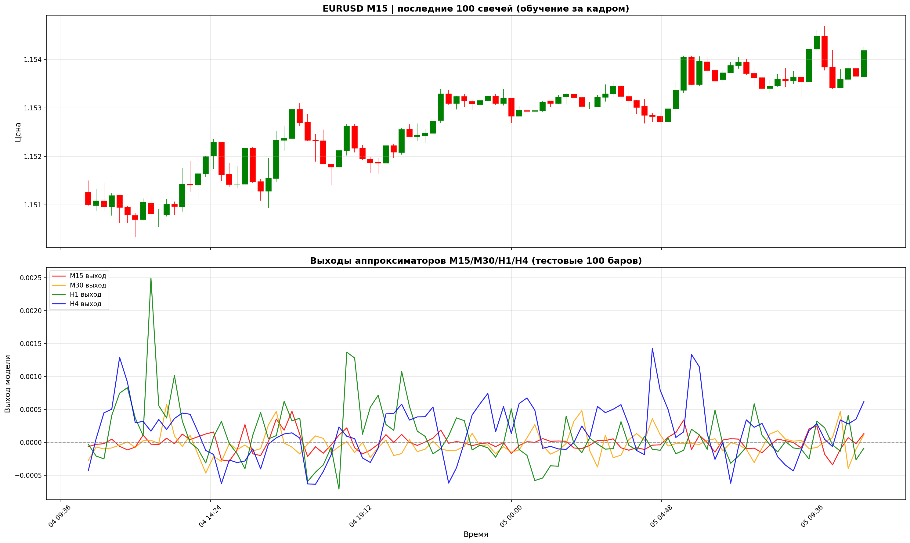 | 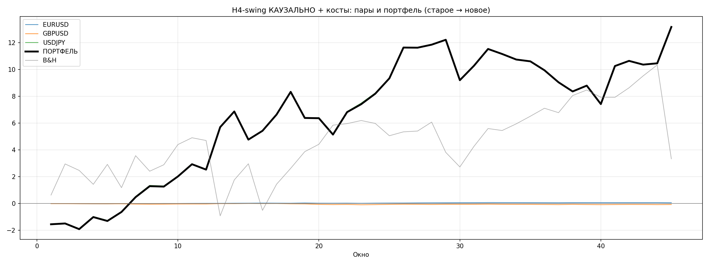 |

| Signals agreement | Signals comparison | Dembel accord |
|---|---|---|
| 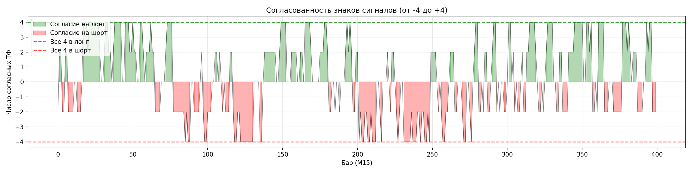 | 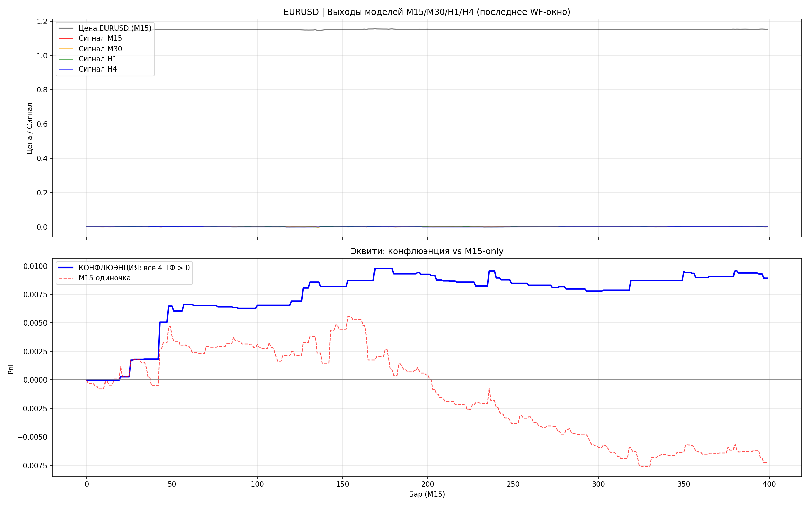 | 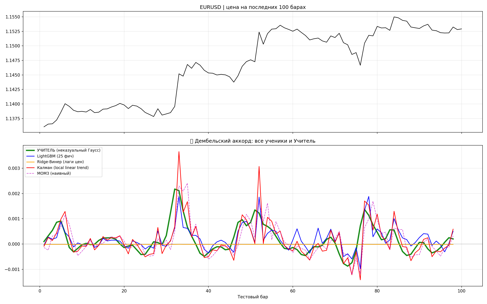 |

| Candles and signals | New rules | Confluence daily WF |
|---|---|---|
| 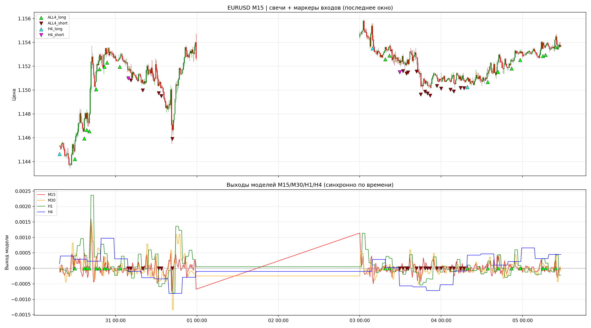 | 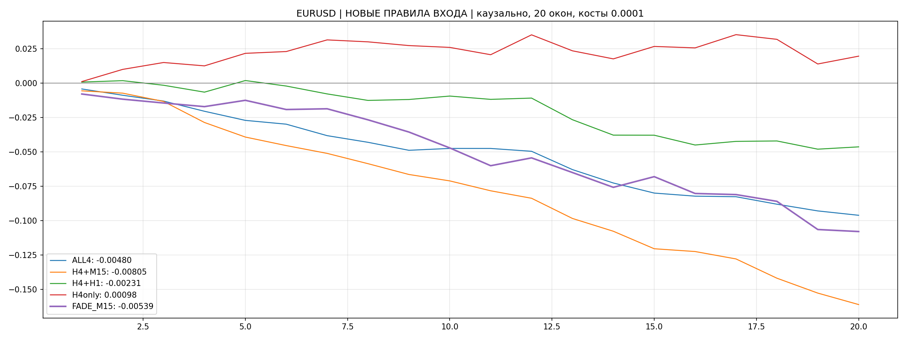 | 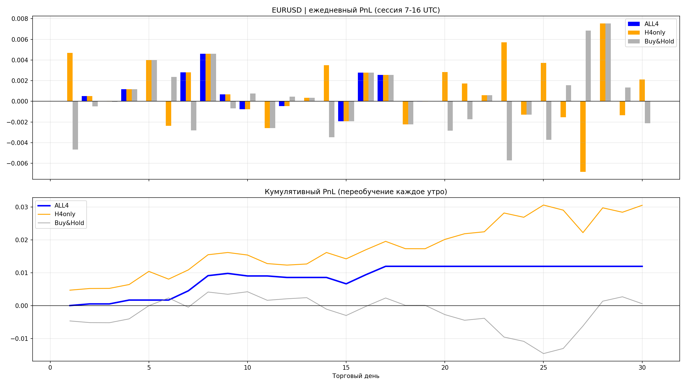 |

Сканы по символам (примеры из `scan_charts*`):

| Базовый | Causal | Kalman |
|---|---|---|
|  | 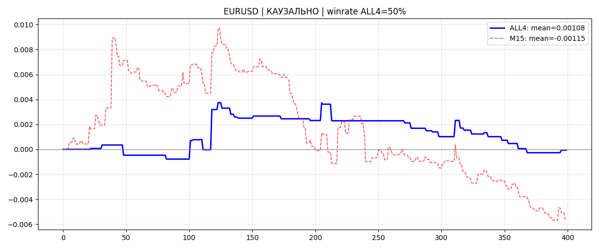 | 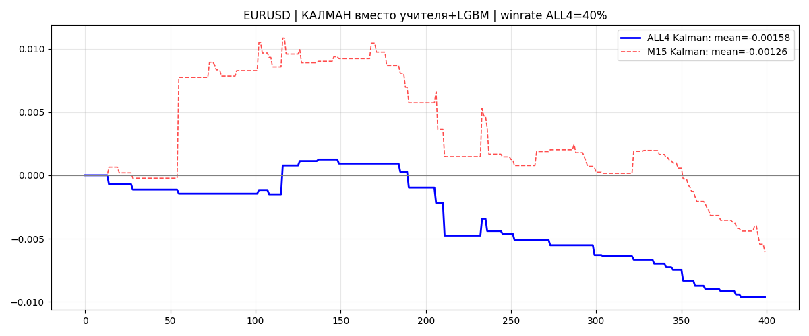 |

## 📁 Структура папок

| Путь | Назначение |
|------|------------|
| `lgbm_pp_approximator_V1*.py`, `V2*.py` | Streamlit-аппроксиматоры производной (V1 → V2, «все работает») |
| `аппроксатор-перврй-производной*.py` | серия v1–v9: ансамбль, мультитайм, воронка, грид, Калман, проверка Гаусса |
| `Неказуальный-учитель*.py` | неказуальный учитель + дашборды (эквити, стат-фичи, ансамбль, мульти) |
| `вход-по-нескольким-таймфреймам*.py` | мультитайм-вход, сессии, ПРОДАКШН, БОТ-версии (EURJPY/GBPJPY/JPY/CHF, DEEPSEEK) |
| `РКалман.py`, `Скан-Калмана.py`, `Вейвлеты.py`, `выбор.py`, `Дкмбель.py` | Калман, сканы, вейвлеты, walk-forward выбор N |
| `111.py`, `2.py` | побочные эксперименты (в т.ч. сокеты Blender) |
| `*.png` (корень) | сводные графики исследований |
| `scan_charts*/` | графики по символам: базовый / causal / d2 / kalman / wavelet |
| `*.txt` | логи запусков рядом со скриптами |
| `requirements.txt`, `Запуск` | зависимости и команда запуска дашборда |
| `KIMIAPI.txt` | описание тестового доступа к Kimi K3 (без ключа) |
| `forex_backtest_results/` | пустая папка результатов бэктестов |

## 🚀 Запуск

```bash
pip install -r requirements.txt
streamlit run lgbm_pp_approximator_V2.py   # интерактивный аппроксиматор
python "Неказуальный-учитель2_дашборд_без_выходных2-эквити-ускорен-стат-фич-ансамбль-мульти.py"
python "вход-по-нескольким-таймфреймам-3-только-сессии-2-ПРОДАКШН.py"
```

Нужен запущенный терминал MetaTrader 5. Для Kimi K3 — свой ключ в `KIMIAPI.py` / bat-файле локально.

## ⬆️ Что не выгружено в репозиторий

Через `.gitignore` отсечены: `KIMIAPI.py`, `Start_Aider_with_KIMI-3.bat`, `API/API.txt` (**содержат API-ключ — не публикуются**), `.aider*` (история сессий), `__pycache__/`.

---

> **ВНИМАНИЕ:** все торговые эксперименты — высокий риск. Результаты на истории не гарантируют будущую прибыль. Проверяйте на демо.
